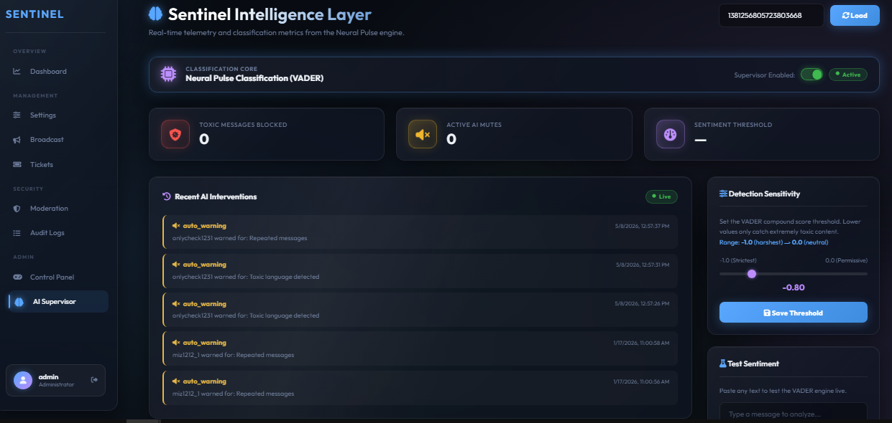
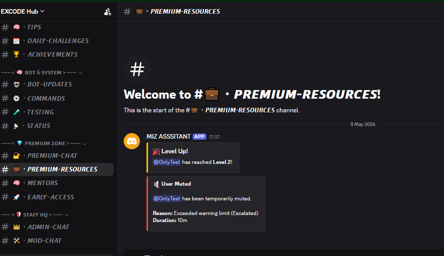
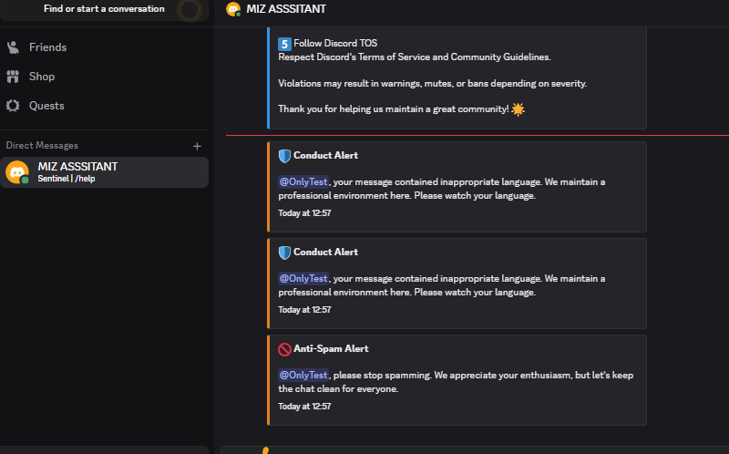
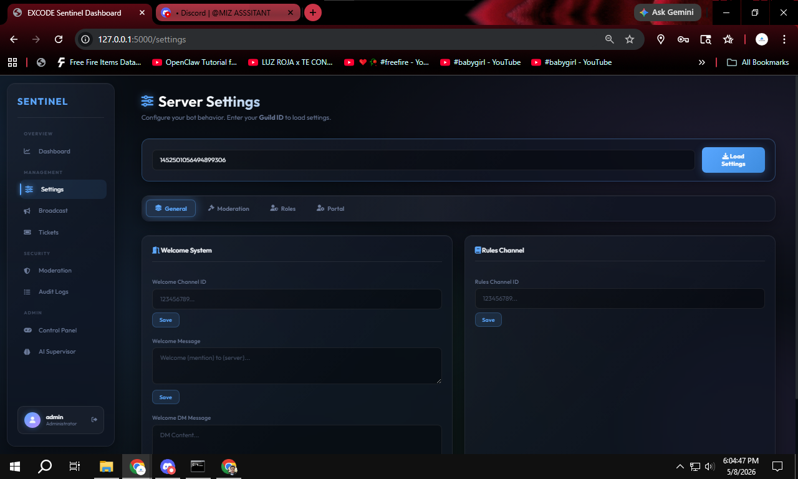
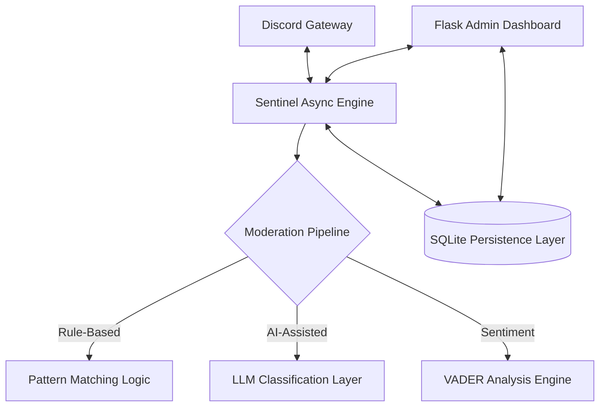

# 🛡️ EXCODE Sentinel — Async Event-Driven Discord Moderation System

> **Problem:** Modern Discord communities struggle with fragmented moderation tools and manual oversight fatigue.  
> **Solution:** EXCODE Sentinel is a rule-based + AI-assisted moderation pipeline that integrates real-time Discord message processing with a Flask-based admin dashboard for centralized community management.

[](https://github.com/miz-dev)
[](https://www.python.org/)
[](https://github.com/Rapptz/discord.py)
[](https://flask.palletsprojects.com/)
[](LICENSE)

---

## 🎥 Live System Demo

<p align="center">
  
</p>

<p align="center"><i>Full async moderation pipeline — detection, escalation, and AI response in real-time.</i></p>

---

## 📊 Admin Dashboard

<p align="center">
  
</p>

<p align="center"><i>Real-time telemetry — VADER sentiment scoring, AI interventions log, and detection sensitivity controls.</i></p>

---

## 🛡️ Moderation Pipeline in Action

<p align="center">
  
</p>

<p align="center"><i>Automated escalation logic — user muted after exceeding warning threshold. Reason and duration injected by the state machine.</i></p>

<p align="center">
  
</p>

<p align="center"><i>Conduct alerts and Anti-Spam detection firing simultaneously — rule-based and AI layers working in parallel.</i></p>

---

## 🤖 AI-Assisted Interaction

<p align="center">
  
</p>

<p align="center"><i>LLM-powered contextual response handling — the bot interprets natural language, executes code, and delivers formatted output inline.</i></p>

---

## ⚙️ Server Settings Panel

<p align="center">
  
</p>

<p align="center"><i>Dynamic server configuration — update welcome messages, moderation thresholds, and role assignments without restarting the bot.</i></p>

---

## 🏗️ System Architecture

Sentinel is built as a fully asynchronous system designed for real-time response and persistent data storage.



---

## ⚙️ Engineering Implementation

### 🛡️ Async Moderation Pipeline
- **Real-Time Message Processing:** Leverages `discord.py`'s async event loop for zero-latency message filtering.
- **Rule-Based Fallback:** Strict heuristic checks for spam, caps, and blacklisted patterns — reliable without API connectivity.
- **Automated Escalation Logic:** Programmable state machine handling warnings → mutes → bans based on persistent infraction counts.

### 🧠 AI-Assisted Intelligence
- **Neural Sentiment Scoring:** Integrates VADER to quantify community sentiment and detect toxicity spikes.
- **LLM Integration:** Gemini/OpenRouter for natural language command parsing and intelligent auto-responses.
- **Fuzzy Intent Matching:** `thefuzz` library for high-accuracy command recognition, reducing invalid command friction.

### 🌐 Flask-Based Admin Dashboard
- **Real-Time Telemetry:** Monitors system vitals (CPU/RAM/Latency) via `psutil` for infrastructure health visibility.
- **SQLite-Backed Persistence:** Structured database for moderation history, ticket transcripts, and server configurations.
- **Dynamic Settings Management:** Responsive UI for updating bot config without requiring process restarts.

---

## 🛠️ Technology Stack

| Layer | Technology |
|---|---|
| Async Framework | Python 3.10+, discord.py |
| Web Dashboard | Flask, HTML5, Vanilla CSS |
| Persistence | SQLite via SQLAlchemy |
| AI / NLP | Google Generative AI, OpenRouter, vaderSentiment |
| System Monitoring | psutil |
| Fuzzy Matching | thefuzz |

---

## 📥 Installation & Setup

1. **Clone Repository:**
   ```bash
   git clone https://github.com/miz-dev/excode-sentinel.git
   cd excode-sentinel
   ```

2. **Environment Configuration:**
   Configure your keys in a `.env` file (see `.env.example`):
   ```env
   DISCORD_BOT_TOKEN=your_token_here
   GEMINI_API_KEY=your_key_here
   ```

3. **Install Dependencies:**
   ```bash
   pip install -r requirements.txt
   ```

4. **Launch Unified System:**
   ```bash
   python run_all.py
   ```

> The `run_all.py` launcher starts both the Discord bot and the Flask dashboard concurrently in a single process.

---

## 📄 License

Distributed under the **MIT License**. See [`LICENSE`](LICENSE) for details.

---

### 👨‍💻 Engineered by [Mr. Miz](https://github.com/miz-dev)
> *"Focusing on robust, event-driven community infrastructure."*
